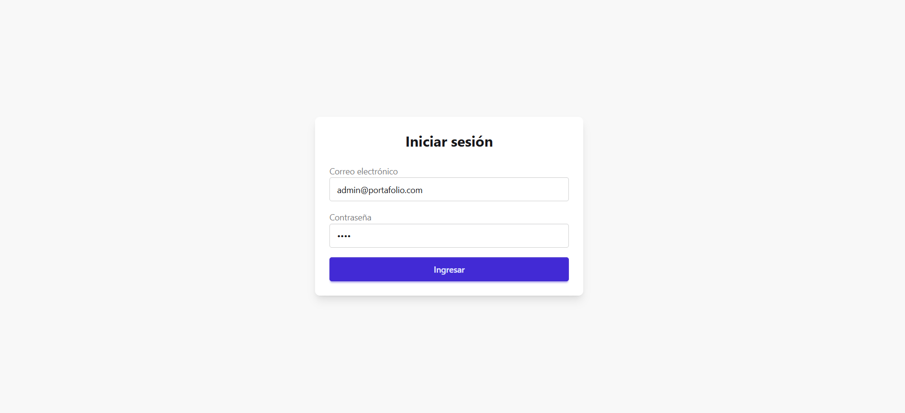
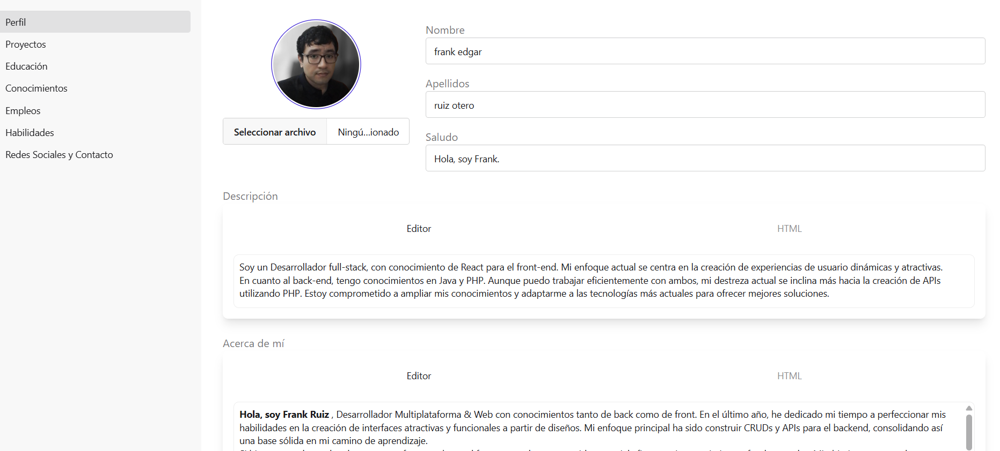
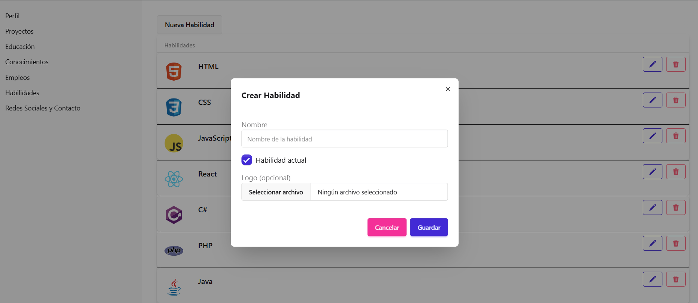
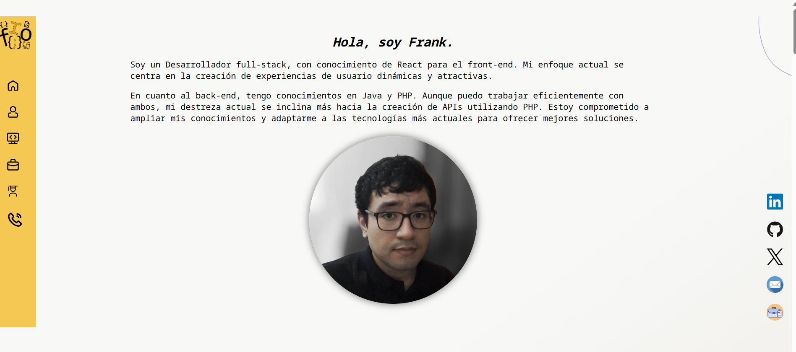
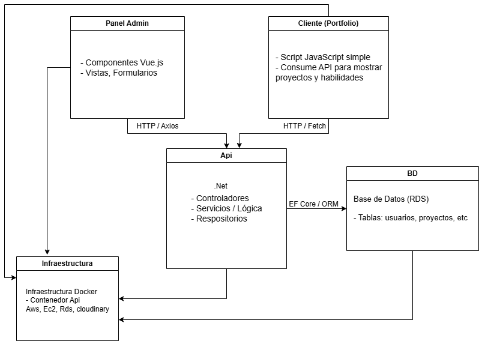
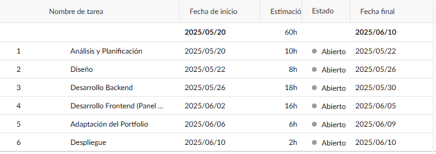
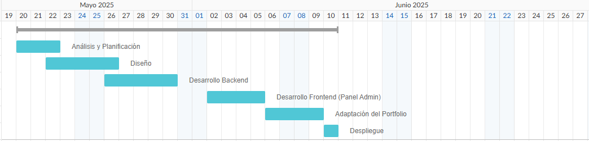
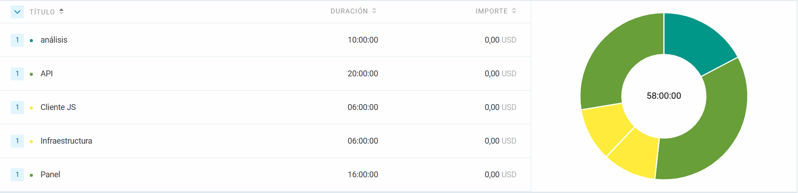

# Sistema de Gestión de Contenido para Portfolio Personal

## 1. Motivación (breve)

La aplicación surge debido a la dificultad de mantenimiento y actualización de un portfolio web estático, donde cada nueva entrada o modificación implica editar archivos JSON o HTML y realizar un despliegue completo, lo que resulta ineficiente, propenso a errores y consume tiempo innecesario.

## 2. Demostración del funcionamiento

A continuación se muestran capturas que ilustran cómo la solución cumple con los objetivos definidos:

* **Login y autenticación**: Acceso seguro al panel de administración mediante JWT.
  
* **Gestión de proyectos**: CRUD completo de proyectos con subida de imágenes.
  
* **Gestión de habilidades**: Añadir, editar y eliminar habilidades dinámicamente.
  
* **Adaptación del frontend**: El portfolio consume datos en tiempo real desde la API.
  

## 3. Justificación de objetivos

| Objetivo                                                      | Estado    |
| ------------------------------------------------------------- | --------- |
| 1. API RESTful con endpoints CRUD y autenticación JWT         | Alcanzado |
| 2. Panel de administración en Vue.js para gestionar contenido | Alcanzado |
| 3. Adaptación del frontend para consumir datos desde la API   | Alcanzado |
| 4. Diseño de base de datos y migraciones con EF Core          | Alcanzado |
| 5. Documentación mínima con Swagger                           | Alcanzado |
| 6. Caché simple (optimización futura)                         | Pendiente |

Las historias de usuario comprometidas (login, CRUD de proyectos, habilidades y perfil) se han implementado según la especificación.

## 4. Descripción técnica

### a. Arquitectura y tecnologías utilizadas

* **Backend**: ASP.NET Core 8.0, C#, Entity Framework Core, JWT, Swagger/OpenAPI.
* **Frontend Admin**: Vue.js 3, Javascript, Axios, TailwindCSS + DaisyUI.
* **Portfolio Cliente**: HTML, CSS, JavaScript adaptado para consumir la API.
* **Infraestructura**: Docker, Docker Compose, AWS (EC2, RDS, S3), GitHub Actions (CI/CD pendiente).

##  Estructura del Proyecto

```
📁 portafolio/
├── 📁 portafolio.backend/          # API backend en .NET Core
│   ├── 📁 Controladores/           # Endpoints de la API
│   ├── 📁 Servicios/               # Lógica de negocio
│   ├── 📁 Dominio/                 # Entidades y DTOs
│   ├── 📁 Contexto/                # Acceso a datos y migraciones
│   └── 📁 Utilidades/              # Helpers y utilidades
├── 📁 portafolio.administracion/   # Panel de administración (Vue.js)
│   ├── 📁 src/                     # Código fuente
│   │   ├── 📁 components/          # Componentes Vue
│   │   ├── 📁 views/               # Vistas de la aplicación
│   │   └── 📁 router/              # Configuración de rutas
└── 📁 portafolio.cliente/          # Frontend público
    ├── 📁 assets/                  # Recursos estáticos
    ├── 📁 css/                     # Estilos CSS
    └── 📁 js/                      # JavaScript para la interactividad
```

### b. Diagrama de componentes

Embed del diagrama de componentes para ilustrar flujos de datos y comunicación entre módulos.




## 6. Metodología de desarrollo

Se utilizó una metodología ágil adaptada (mini-sprints semanales) con GitHub Flow:

* Rama `main` para versiones estables.
* Ramas de develop y Pull Requests revisados antes de merge.
* Revisiones de código y pruebas unitarias con xUnit/Moq. (pendiente)

## 7. Planificación: Gantt inicial vs. final

* **Gantt inicial**: planificación basada en estimaciones de tiempo por fase.
* **Gantt final**: reflejó ajustes, aumentando el desarrollo backend en 2 h y despliegue en 4 h.





**Análisis de desviaciones**:

* +2 h en Backend debido a integración de JWT y manejo de migraciones complejas.
* +4 h en aws debido a configuraciones y grupos de seguridad.

## 8. Clockify del desarrollo

### a. Tiempo invertido por componente




### b. Análisis del tiempo invertido

El mayor esfuerzo se destinó a:

* **Backend API** (38%): configuración de autenticación y migraciones.
* **Frontend Admin** (34%): integración de Vue y validaciones del lado cliente.
* **Adaptación Portfolio** (8%): refactor para consumo dinámico.

## 9. Presupuesto de la app

| Fase                              | Horas | Tarifa (€ /h) | Coste Mano de Obra (€) | Software Amortizado (€) |
| --------------------------------- | ----- | ------------- | ---------------------- | ----------------------- |
| Análisis y Planificación          | 10    | 25            | 250                    | 5                       |
| Diseño                            | 8     | 25            | 200                    | 5                       |
| Desarrollo Backend                | 18    | 25            | 450                    | 10                      |
| Desarrollo Frontend (Panel Admin) | 16    | 25            | 400                    | 10                      |
| Adaptación Portfolio              | 6     | 25            | 150                    | 5                       |
| Documentación                     | 3     | 25            | 75                     | 2                       |
| Despliegue                        | 2     | 25            | 50                     | 3                       |
| **Total**                         | 63    | —             | **1575**               | **40**                  |

## 10. Conclusiones

### a. Principales dificultades

* Configuración inicial de Docker y AWS.
* Implementación de JWT y flujo de autenticación.
* Restricción de tiempo (60 h) para un MVP completo.

### b. Posibles mejoras

* Sistema de caché y optimización de imágenes.
* Búsqueda y filtrado avanzado en el panel.
* Internacionalización (i18n) del contenido.
* Integración de CI/CD completa con tests automáticos.

